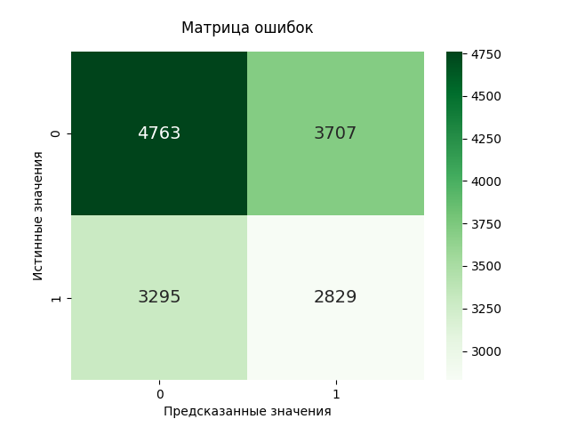
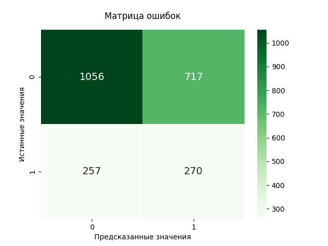
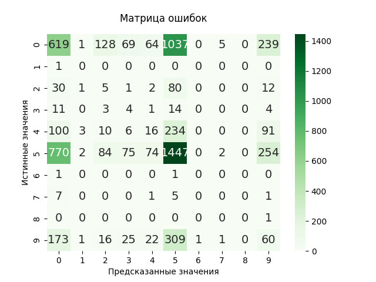
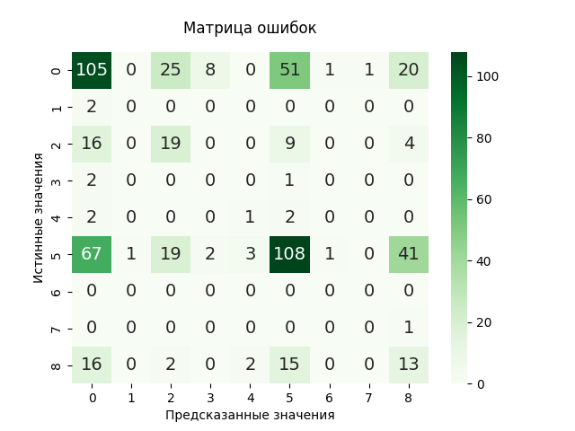

# Star Classificator
____

# Анализ применения методов машинного обучения для классификации переменных звезд

## Введение

  Изучение переменных звёзд остаётся одной из актуальных задач современной астрономии, поскольку изменения их яркости отражают фундаментальные процессы, происходящие в звёздах и двойных системах.
  Цель данного исследования состоит в разработке комплексной модели, способной шаг за шагом улучшать качество классификации: от базовой бинарной модели до сложного мультиклассового классификатора с интеграцией информации о временной изменчивости объектов

## Постановка задачи
  1. Бинарная классификация: Построить модель, способную отличать переменные звёзды от статичных объектов.
  2. Многоклассовая классификация: Разработать систему, позволяющую распределять переменные звёзды по типам (например, цефеиды, RR Лиры, затменные системы) с учётом спектральных и фотометрических характеристик.
  3. Интеграция временных рядов: Внедрить анализ кривых блеска для выделения динамических признаков, таких как периодичность и амплитуда изменений яркости, и объединить их с другими данными для повышения точности классификации.

### Используемые библиотеки
Для реализации проекта были использованы следующие библиотеки Python:
- **Matplotlib** — визуализация данных.
- **Scikit-learn** — соддержит различные алгоритмы для машинного обучения.
- **Pandas** — работа с базами данных, предварительная обработка данных.

### Используемые методы машинного обучения
На данный момент разработан классификатор, использующий такой метод машинного обучения, как случайный лес
Планируется также рассмотреть эффективность работы следующих методов машинного обучения:
  1. Метод опорных векторов (SVM)
  2. Градиентный бустинг

### Описание исходных данных
Были использованы каталоги APASS DR9, 2MASS, GALEX GR5 MIS. В них содержатся данные о спектральных данных звезд, инафракрасные и рентгеновские наблюдения.
Исследование опиралось в основном на каталог (APASS DR9) Х (GALEX GR5 MIS). Каталог (APASS DR9) Х (2MASS) был взят для проверки обучения.

### Предварительная обработка данных
- Было проведено два теста. В первом в качестве исходных данных принимались положения звезды (первые 3 колонки), значение B-V, колонки ipmag, rpmag, gpmag. Во втором добавлялись колонки fuv_mag и nuv_mag
- Для этих колонок проводилось очищение от пустых данных
- Также были удалены данные о звездах, для которых производилось менее 5 наблюдений (колонка nobs)
- Для первого теста для обучения брались все очищенные данные из (APASS DR9) Х (GALEX GR5 MIS). Для проверки брались очищенные данные из (APASS DR9) Х (2MASS)
- Для второго теста обучение и проверка проводились на (APASS DR9) Х (GALEX GR5 MIS) в соотношении ~95/5

## Результаты

### Бинарный классификатор

#### Случайный лес (Random Forest)

##### Тест №1
- Accuracy: 0.520
- Precision: 0.433
- Recall: 0.462
- Specificity: 0.562
- F1 score: 0.447
- 

##### Тест №2
- Accuracy: 0.577
- Precision: 0.274
- Recall: 0.512
- Specificity: 0.596
- F1 score: 0.357
- 

### Многоклассовый классификатор

#### Случайный лес (Random Forest)

##### Тест №1
- 

##### Тест №2
- 
